# Hosting a Full-Stack Application
[](https://dl.circleci.com/status-badge/redirect/gh/polarbeargo/cd0292-nd0067-c4-deployment-process-project-starter/tree/master)


# Udagram

This application is provided to you as an alternative starter project if you do not wish to host your own code done in the previous courses of this nanodegree. The udagram application is a fairly simple application that includes all the major components of a Full-Stack web application.


### Dependencies

```
- Node v14.15.1 (LTS) or more recent. While older versions can work it is advisable to keep node to latest LTS version

- npm 6.14.8 (LTS) or more recent, Yarn can work but was not tested for this project

- AWS CLI v2, v1 can work but was not tested for this project

- A RDS database running Postgres.

- A S3 bucket for hosting uploaded pictures.

```

### Installation

Provision the necessary AWS services needed for running the application:

1. In AWS, provision a publicly available RDS database running Postgres. <Place holder for link to classroom article>
1. In AWS, provision a s3 bucket for hosting the uploaded files. <Place holder for tlink to classroom article>
1. Export the ENV variables needed or use a package like [dotnev](https://www.npmjs.com/package/dotenv)/.
1. From the root of the repo, navigate udagram-api folder `cd starter/udagram-api` to install the node_modules `npm install`. After installation is done start the api in dev mode with `npm run dev`.
1. Without closing the terminal in step 1, navigate to the udagram-frontend `cd starter/udagram-frontend` to intall the node_modules `npm install`. After installation is done start the api in dev mode with `npm run start`.

## Testing

This project contains two different test suite: unit tests and End-To-End tests(e2e). Follow these steps to run the tests.

1. `cd starter/udagram-frontend`
1. `npm run test`
1. `npm run e2e`

There are no Unit test on the back-end

### Unit Tests:

Unit tests are using the Jasmine Framework.

### End to End Tests:

The e2e tests are using Protractor and Jasmine.

## Built With

- [Angular](https://angular.io/) - Single Page Application Framework
- [Node](https://nodejs.org) - Javascript Runtime
- [Express](https://expressjs.com/) - Javascript API Framework

## Documentation
- [Pipeline Description](docs/Pipeline_description.md)
- [Infrastructure Description](docs/Infrastructure_description.md)
- [Application Dependencies](docs/Application_dependencies.md)

## Demo
A live demo of the application can be found at [Udagram Demo](http://mybucket1342uyew.s3-website-us-east-1.amazonaws.com).

Frontend
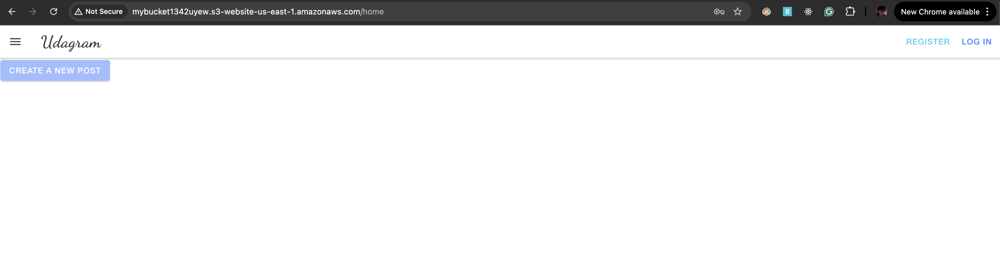

Backend
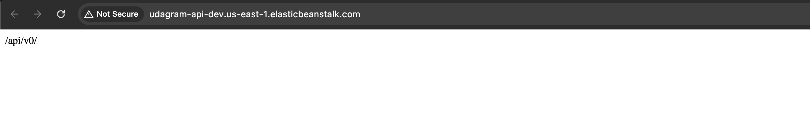

- Below are key screenshots illustrating the deployment process and AWS resources used in this project:

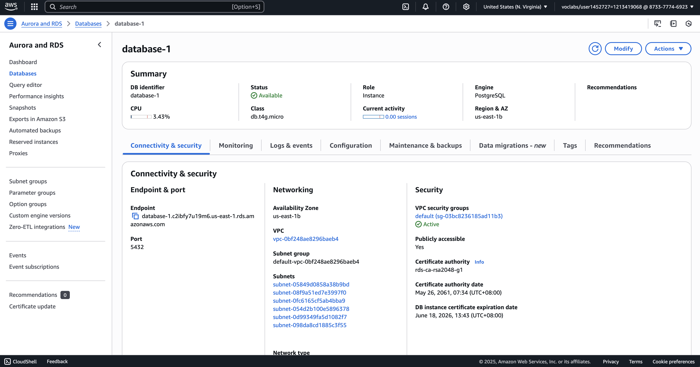  
    *Amazon RDS dashboard showing the details of the database instance.*

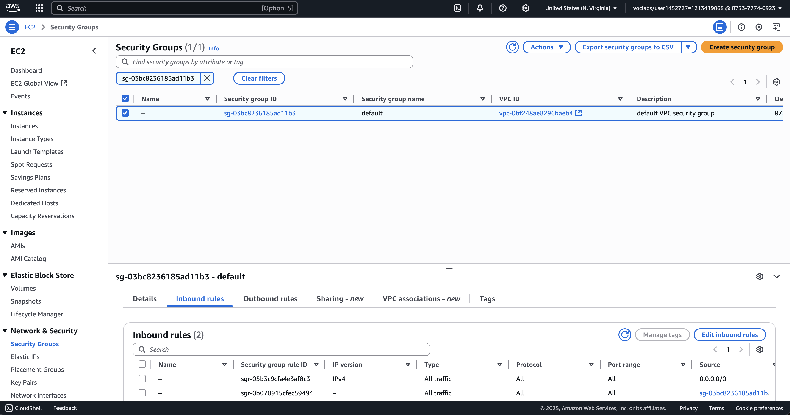  
    *Detailed view of the RDS instance security group configuration, including endpoint and connectivity settings.*

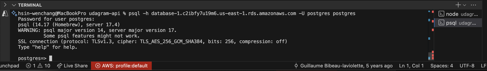  
    *Connecting from local development environment to the RDS instance.*

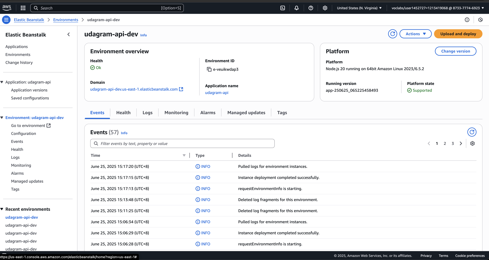  
    *AWS Elastic Beanstalk environment dashboard, showing the status of the deployed api.*

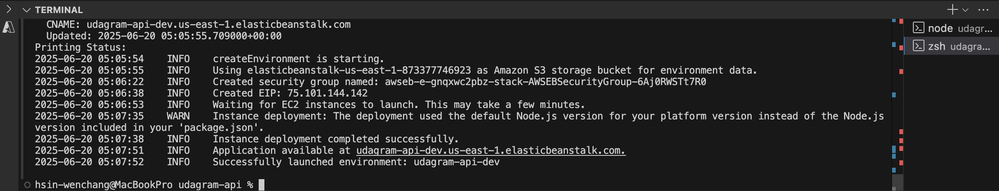  
    *From local environment terminal, showing api deploy to ElasticBeanstalk health and recent events.*

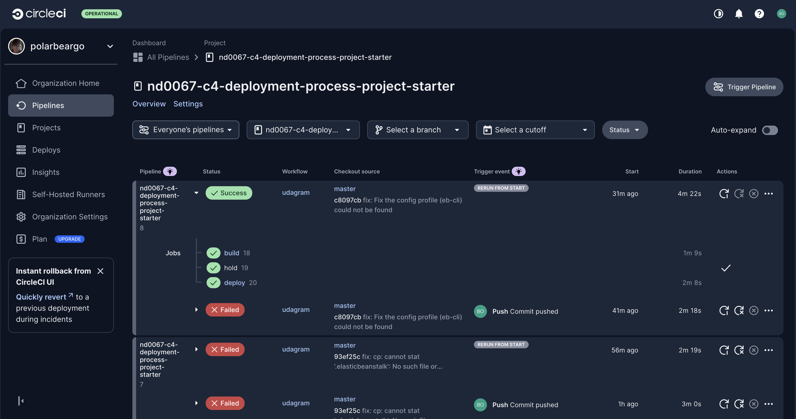  
    *CircleCI dashboard overview, highlighting recent pipeline runs.*

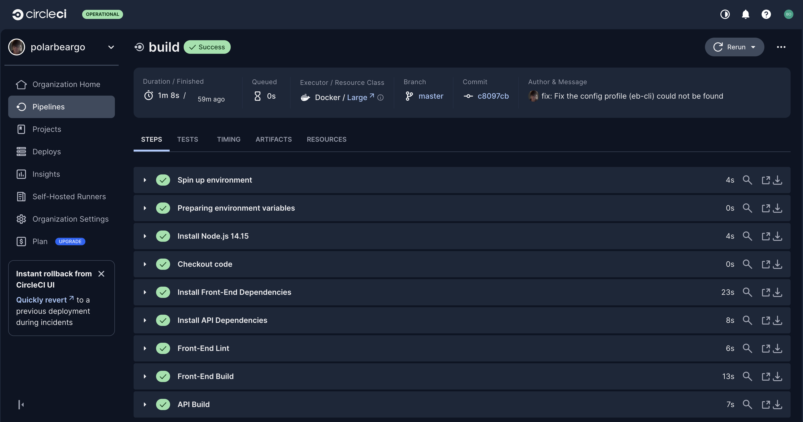  
    *CircleCI build job details, showing successful build steps.*

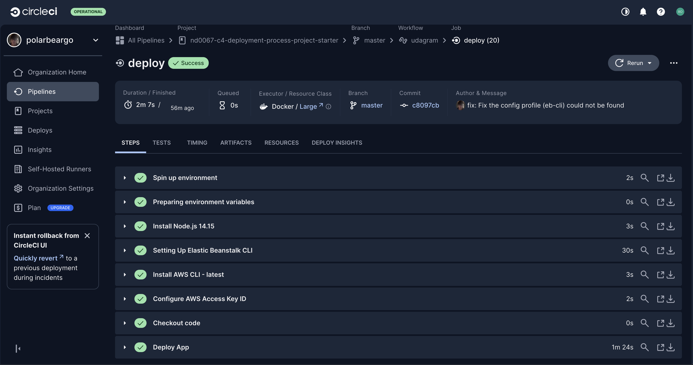  
    *CircleCI deployment job details, confirming successful deployment to AWS.*

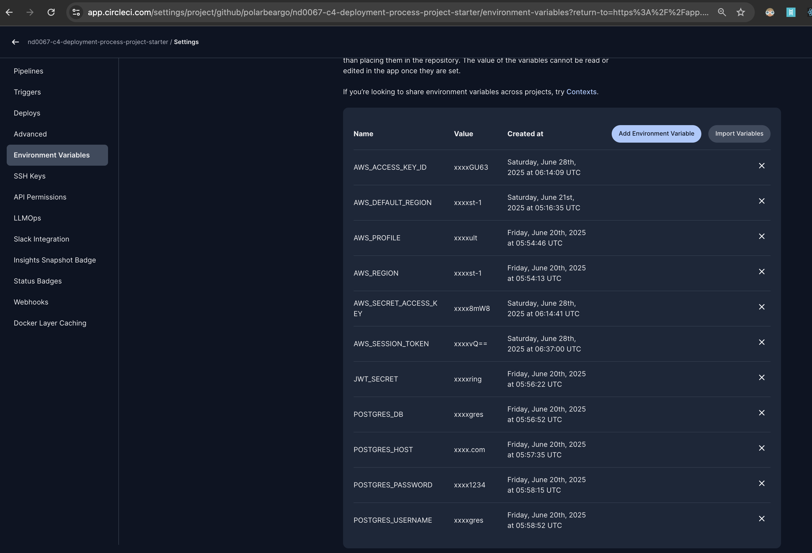
    *CircleCI environment variables configuration, showing sensitive data management.*

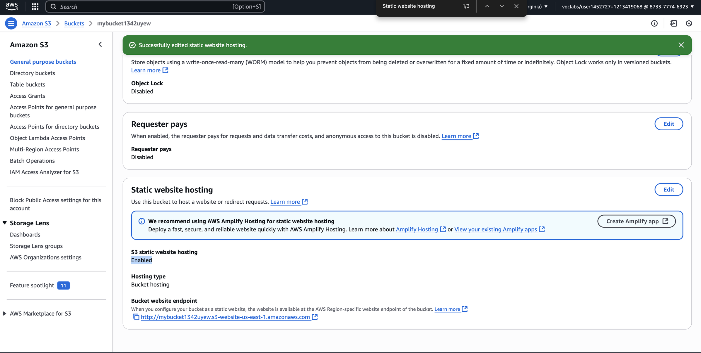  
    *AWS S3 bucket dashboard, displaying the contents of the bucket used for hosting the frontend.*

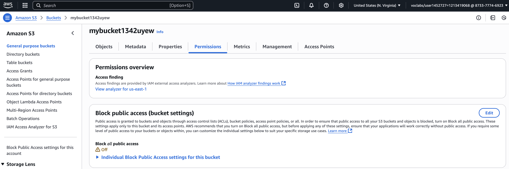
    *AWS S3 bucket public access settings, showing the configuration for allowing public access to the hosted frontend.*
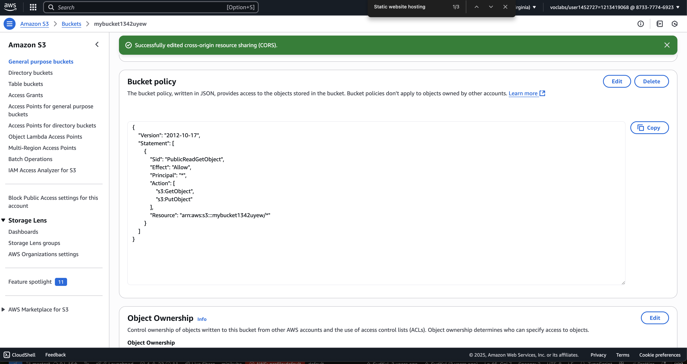  
    *S3 bucket policy configuration, ensuring proper permissions for public access to the frontend files.*

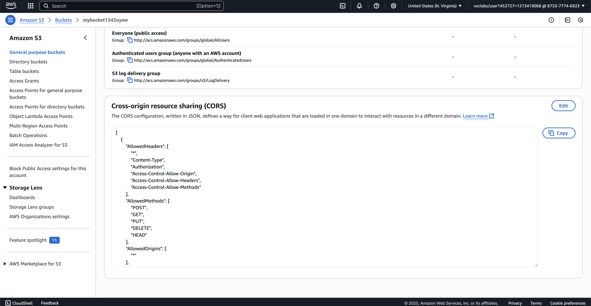 
    *S3 bucket CORS configuration, allowing cross-origin requests from the frontend.*

## License

[License](LICENSE.txt)
